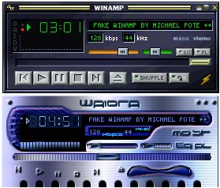



## Fake Winamp

### Description

This code is an improvement on an original fake winamp I saw here at PSC. This version is slightly more advanced and is fully commented. Right now, it only has a fully clickable user interface which loads winamp skins.
 
### More Info
 

             |
---                |---
**Submitted On**   |2001-04-09 15:47:48
**By**             |[Michael Pot&\#232;](https://github.com/Planet-Source-Code/PSCIndex/blob/master/ByAuthor/michael-pot-232.md)
**Level**          |Advanced
**User Rating**    |4.8 (24 globes from 5 users)
**Compatibility**  |VB 5\.0, VB 6\.0
**Category**       |[Graphics](https://github.com/Planet-Source-Code/PSCIndex/blob/master/ByCategory/graphics__1-46.md)
**World**          |[Visual Basic](https://github.com/Planet-Source-Code/PSCIndex/blob/master/ByWorld/visual-basic.md)
**Archive File**   |[Fake Winam18122492001\.zip](https://github.com/Planet-Source-Code/michael-pot-232-fake-winamp__1-22247/archive/master.zip)

